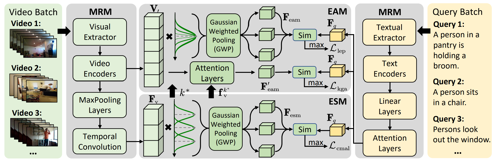
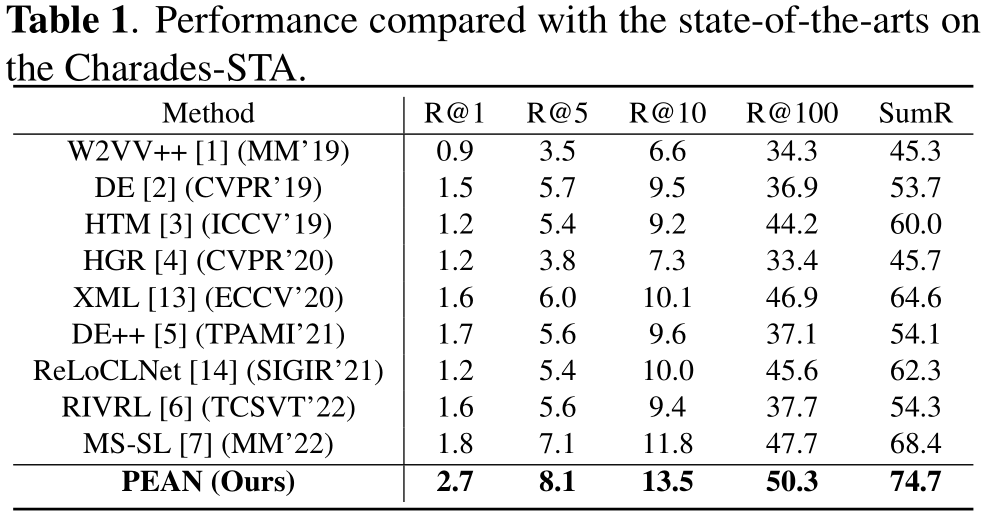
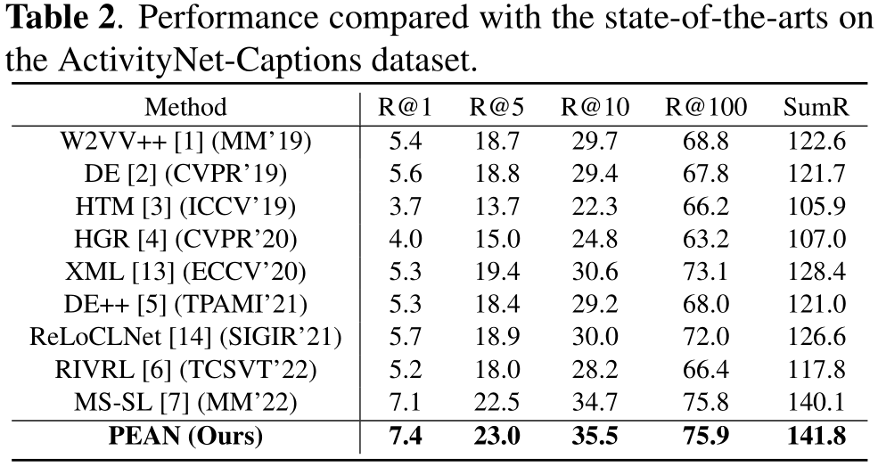
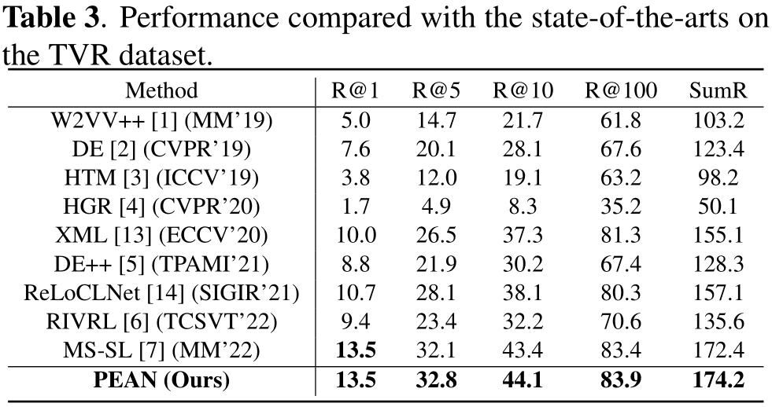
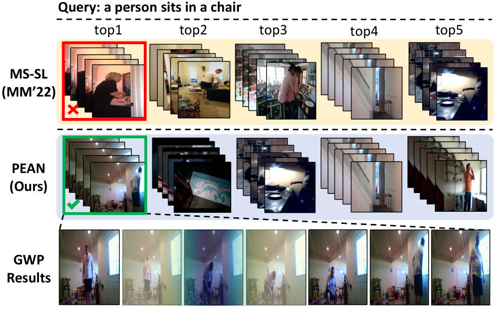

# Introduction
PyTorch implementation for the paper "Progressive Event Aligntment Network For Partial Relevant Video Retrieval".



# Environments 
* **python 3.8**
* **pytorch 1.9.0**
* **torchvision 0.10.0**
* **tensorboard 2.6.0**
* **tqdm 4.62.0**
* **easydict 1.9**
* **h5py 2.10.0**
* **cuda 11.1**

# Training and Evaluation

## Training
Run the following scripts to train `PEAN` on the corresponding dataset.

```
#Add project root to PYTHONPATH (Note that you need to do this each time you start a new session.)
source setup.sh

ROOTPATH=$HOME/VisualSearch
EXP_ID=runs_0
GPU_DEVICE_ID=0

./xxx.sh $EXP_ID $ROOTPATH $GPU_DEVICE_ID
```

## Evaluation
The model is placed in the directory $ROOTPATH/$DATASET/results/$MODELDIR after training. Run the following script to evaluate it(Suppose the model is trained on Charades-STA):
```
DATASET=charades
FEATURE=i3d_rgb_lgi
ROOTPATH=$HOME/VisualSearch
MODELDIR=charades-runs_0-2022_07_11_20_27_02

./test.sh $DATASET $FEATURE $ROOTPATH $MODELDIR
```

# Model Performance 

## Charades-STA
<!-- |             | R@1  | R@5  | R@10 | R@100 | SumR  |
| :---------: | :--: | :--: | :--: | :---: | :---: |
| Text-to-Video | 2.7 | 8.1 | 13.5 | 50.3  | 74.7 | -->


## Activitynet Captions
<!-- |             | R@1  | R@5  | R@10 | R@100 | SumR  |
| :---------: | :--: | :--: | :--: | :---: | :---: |
| Text-to-Video | 7.4 | 23.0 | 35.5 | 75.9  | 141.8 | -->


## TVR
<!-- |             | R@1  | R@5  | R@10 | R@100 | SumR  |
| :---------: | :--: | :--: | :--: | :---: | :---: |
| Text-to-Video | 13.5 | 32.8 | 44.1 | 83.9  | 174.2 | -->



## Visualization



